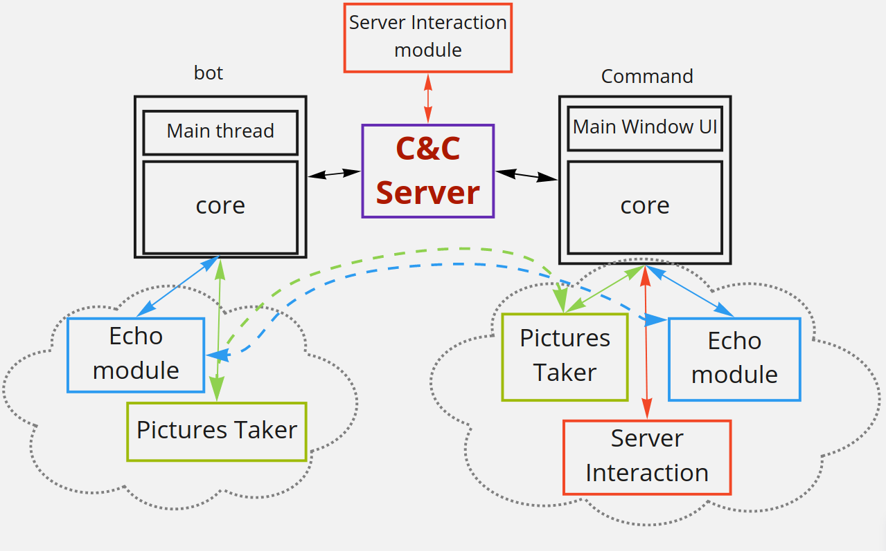

# RAT - remote administration tool or remote access trojan

Goal of this project is to consolidate existing knowledge and develop a cross-platform system of
remote access for the wide variety of devices (workstations, servers, single-board computers, etc). Designed suite of tools consists of 3 components: GUI app for managing, C&C server and a “bot” (control-side, server, bot-side)

- control-side: Crafts control messages/instructions and passes them to the server
- server: Implements routing of messages (Passes data between connected components/apps)
- bot-side: Executes instruction, passes execution results to the requesting node via server

---

## Components interaction

---

## Messages transferring

---

## Client core structure

---

